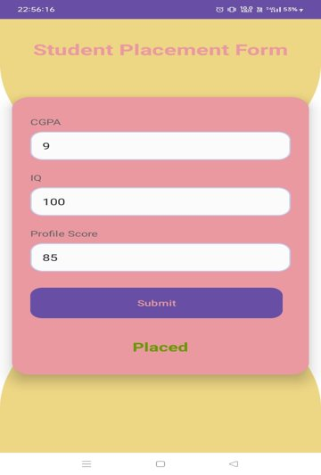

# Placement Prediction Android App



This project is a Flask-based API for predicting student placements based on their CGPA, IQ, and profile score. The model is trained using machine learning techniques and is deployed as a web service.

## Project Description

The API takes three input parameters:
- CGPA
- IQ
- Profile Score

It returns a prediction indicating whether the student will be placed or not.

## Setup Instructions

1. Clone the repository:
    ```sh
    git clone <repository-url>
    cd Placedment-prediction-android-app
    ```

2. Create a virtual environment and activate it:
    ```sh
    python -m venv venv
    source venv/bin/activate  # On Windows use `venv\Scripts\activate`
    ```

3. Install the required packages:
    ```sh
    pip install -r requirements.txt
    ```

4. Run the Flask app:
    ```sh
    python app.py
    ```

## Usage

1. Start the Flask server by running `python app.py`.
2. Use a tool like Postman or cURL to send a POST request to the `/predict` endpoint with the required parameters:
    ```sh
    curl -X POST -F 'cgpa=8.5' -F 'iq=120' -F 'profile_score=85' http://127.0.0.1:5000/predict
    ```

3. The API will return a JSON response with the placement prediction.

## Deployment

To deploy this application, you can use platforms like Heroku, AWS, or any other cloud service provider. Make sure to set the `PORT` environment variable if required by the platform.

## License

This project is licensed under the MIT License.

## Contributing

Feel free to submit issues or pull requests if you have any improvements or suggestions.
